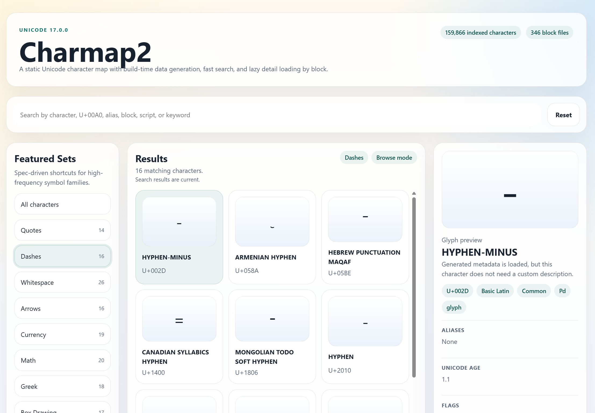

# Charmap2

Charmap2 is a static Unicode character map for the browser. It is built to replace the parts of Windows Character Map that people actually use, with faster search, clearer metadata, and better copy behavior.

## Live Site

- Site: <https://llaurila.github.io/charmap2/>



## What it does

- search by character, official name, alias, abbreviation, block, script, or code point
- preview the selected character with richer metadata
- explain confusing invisible, control, formatting, and combining characters
- copy the raw character plus common escaped forms
- ship as a static site with no backend

## Status

Charmap2 is an early public project, but the repository already includes a working app, Unicode ingestion scripts, generated data, and tests. The current focus is polishing the MVP around single Unicode code points, including single-code-point emoji.

See `SPECS.md` for the current product and implementation direction.

## Stack

- Vite
- React
- TypeScript
- Vitest
- official Unicode Character Database files as the source of truth

## Local development

Requirements:

- Node.js 22 or newer
- npm

Install dependencies:

```bash
npm install
```

Start the dev server:

```bash
npm run dev
```

Run tests:

```bash
npm test
```

Build the app:

```bash
npm run build
```

## Unicode data pipeline

- vendored Unicode source files live under `vendor/unicode/17.0.0/`
- the app generates static assets into `public/unicode/17.0.0/`
- the browser uses generated JSON, not raw Unicode text files

Useful commands:

```bash
npm run vendor:unicode
npm run generate:unicode
```

## Contributing

Issues and pull requests are welcome. Please read `CONTRIBUTING.md` before making larger changes.

For behavior changes that affect product scope, search rules, rendering rules, or data semantics, check `SPECS.md` first and call out any intentional spec changes in your PR.

## License

The Charmap2 source code is licensed under the MIT License. See `LICENSE`.

This project also vendors and derives data from the Unicode Character Database. See `THIRD_PARTY_NOTICES.md` for attribution and related terms.
